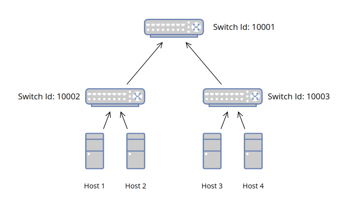

# Usom IP Blocker using OpenFlow

### What is OpenFlow Protocol?
The OpenFlow (OF) protocol is a standard in software-defined networking (SDN) architecture. This protocol defines the communication between an SDN controller and the network device/agent. 

### What is SDN?
Software-Defined Networking (SDN) is an approach to networking that uses software-based controllers or application programming interfaces (APIs) to communicate with underlying hardware infrastructure and direct traffic on a network.

### The Aim of Project
The aim of Usom IP Blocker project prevents all packets that request from host to blocked urls in topology which pictured below. 

### Topology Structure



## Start Setup

### SDN Controller
```bash
sudo ryu-manager SDNSwitch.py
```

### Mininet Topology
```bash
sudo python3 MyTopology.py
```
### Test - 1
When we send ping a command to google.com (216.58.207.227) over host h1, we can see connection that is alive. Also, we can analyze logs of S1 Switch, number of packets increase.


### Test - 2
When we send ping a command to gohtci.com (64.111.117.54) over host h2, we can see connection that is not alive. Also, we can analyze logs of S1 Switch, number of packets increase and flow action is drop.

